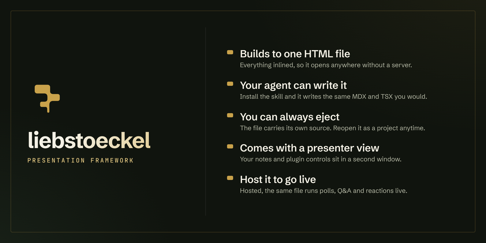

# liebstoeckel



[](https://github.com/liebstoeckel/liebstoeckel-app/actions/workflows/ci.yml)
[](./LICENSE)
[](https://docs.liebstoeckel.app)
[](https://bun.com)

liebstoeckel is a code-first presentation engine. You write slides in MDX for prose and TSX for anything interactive, theme them from one place, and build a single portable `.html` per deck.
It runs on Bun, React 19, Motion, and Tailwind v4.

Being technical-first is the point: a deck is plain source you edit and own.

That targets a specific problem with AI-built decks. When an agent generates a presentation, the output is usually a finished artifact you cannot open up and edit by hand. liebstoeckel keeps a deck as plain TSX and MDX, and every build inlines its own source into the `.html`, so the file can be ejected back into an editable project. An agent writes the deck; you still own it and can change it.

Every deck ships with a presenter view and runs offline as a single file. When you want the room involved, the CLI hosts that same file as a live session and syncs state between presenter and audience, so people answer polls, ask questions, and send reactions from their own devices.

The [what is liebstoeckel?](https://docs.liebstoeckel.app/guides/what-is-liebstoeckel/) page covers the reasoning.

## Getting started

All you need is [Bun](https://bun.com) 1.3 or newer; the first line installs it through npm if you do not have it. A browser is enough to view a deck, and a Chromium is optional for build-time thumbnails.

Install the CLI and hand the authoring skill to your agent:

```bash
npm install -g bun              # skip if you already have Bun 1.3+
bun add -g @liebstoeckel/cli    # the liebstoeckel CLI
liebstoeckel skill install      # teach your coding agent the workflow
```

Then scaffold a deck and run it:

```bash
liebstoeckel new my-talk
cd my-talk
bun install
bun run dev                     # dev server with HMR
```

Build to a single file when you are ready to share:

```bash
liebstoeckel build              # -> dist/my-talk.html
```

That output is one `.html` with the JS, CSS, fonts, and assets inlined. No server, no CDN, no runtime deps. Open it directly, email it, or host it on anything static. It also embeds its own source by default, so `liebstoeckel eject` can turn the file back into an editable project.

Working in this repository rather than a scaffolded deck? Run `bun install`, then `bun run demo:dev` for the minimal demo (port 3000) or `bun run showcase:dev` for the visx data-viz deck (port 3001).

> liebstoeckel is pre-1.0. Breaking changes can land in minor releases, so pin exact versions if a deck has to keep building unchanged.

## From a prompt to a deck

With the skill installed, ask your agent for a deck:

```bash
claude "Create a presentation comparing the glycemic index of different foods"
```

It reads the component registry, scaffolds the deck, writes the slides, and reruns `build --check` until the deck compiles. The result is one `.html` file. Here is the deck that session produced, playing through its slides:

https://github.com/user-attachments/assets/59cb7ff6-0075-4fb7-b03b-fa00a469bb6f

The springs and reveals come from the engine, not the model. The whole deck is one file: [open it in your browser](https://liebstoeckel.app/glycemic-index.html), or see the full demo on [liebstoeckel.app](https://liebstoeckel.app).

## Features

Every command targets a deck by a leading path, `--dir <deck>`, or the current directory. Run `liebstoeckel --help` for the whole surface; the [CLI reference](https://docs.liebstoeckel.app/reference/cli/) documents each flag.

| Capability | Command | Reference |
| --- | --- | --- |
| Scaffold a workspace-wired deck | `liebstoeckel new <name>` | [new](https://docs.liebstoeckel.app/reference/cli/#new) |
| Build one self-contained `.html`, thumbnails embedded | `liebstoeckel build` | [build](https://docs.liebstoeckel.app/reference/cli/#build) |
| Validate a deck without writing an artifact | `liebstoeckel build --check` | [build](https://docs.liebstoeckel.app/reference/cli/#build) |
| Recover a built deck's editable source | `liebstoeckel eject <deck.html>` | [eject](https://docs.liebstoeckel.app/reference/cli/#eject) |
| Present live over a LAN, or `--relay <url>` | `liebstoeckel live` | [live](https://docs.liebstoeckel.app/reference/cli/#live) |
| Run a public relay for WAN sessions | `liebstoeckel relay` | [relay](https://docs.liebstoeckel.app/reference/cli/#relay) |
| Export slides to PNG or PDF | `liebstoeckel export` | [export](https://docs.liebstoeckel.app/reference/cli/#export) |
| Regenerate thumbnails for a built deck | `liebstoeckel thumbs <deck.html>` | [thumbs](https://docs.liebstoeckel.app/reference/cli/#thumbs) |
| Add registry items into a deck as owned source | `liebstoeckel add <name>` | [add](https://docs.liebstoeckel.app/reference/cli/#add) |
| Browse the chart and component registry as JSON | `liebstoeckel registry list` | [registry](https://docs.liebstoeckel.app/reference/cli/#registry) |
| Install the agent authoring skill | `liebstoeckel skill install` | [skill](https://docs.liebstoeckel.app/reference/cli/#skill) |

Cloud commands (`login`, `push`, `orgs`, `decks`, `brand`) upload a deck to the hosted service and are coming soon. See [cloud commands](https://docs.liebstoeckel.app/reference/cli/#cloud-commands-coming-soon).

## Architecture

liebstoeckel is a Bun monorepo built around `engine`, which compiles a deck with `Bun.build` (inlining the JS, CSS, and fonts) and runs it: a fixed-canvas `ScaledStage`, Motion transitions, keyboard and touch navigation, the presenter view, and the live client. `theme` holds the typed token model and the pipeline from brand tokens to CSS variables, so a deck re-skins by switching `data-brand`. `components` provides the themed MDX primitives and Magic Move. `plugin-sdk` and `plugin-ui` build the Yjs-synced plugins from typed CRDT state, and `live-server` and `present-relay` host that shared document for a LAN room or the public internet. `thumbnails` captures slide previews at build time, and `cli` is the single command over all of it. Each package has its own README; the [architecture](https://docs.liebstoeckel.app/concepts/architecture/) and [state model](https://docs.liebstoeckel.app/concepts/state-model/) pages go deeper.

## Documentation

Full guides, concepts, plugin authoring, and the API reference live at [docs.liebstoeckel.app](https://docs.liebstoeckel.app). The source is in [`packages/docs`](./packages/docs).

## License

[MPL-2.0](./LICENSE). See each package for details.
